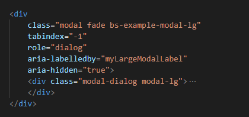
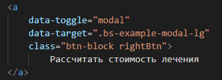

# Плагин расчета стоимости 
***
### Перечень скриптов для  использования
1. Jquery 1.11.1
2. Bootstrap JS 3.3.7
3. Bootstap CSS 3.3.7

### Подключение плагина
1. Загрузить папки images, img
2. Загрузить скрипты (thooth.js) и стили (thooth.css)
3. Подключить скрпиты, а так же скрипты и стили указанные в перечне 
4. Разместить блок из файла index.html у себя на странице

5. Прописать нужные пути для файлов с картинками
6. Разместить кнопку для вызова модального окна с атрибутами 
    data-toogle и data-target
    

